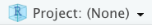
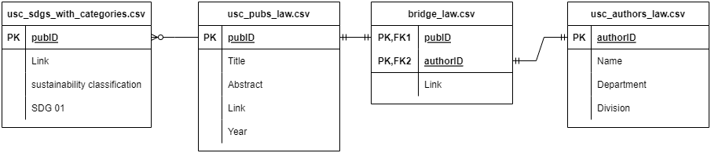

<!-- README.md is generated from README.Rmd. Please edit README.Rmd -->

```{r setup, include=FALSE}
knitr::opts_chunk$set(echo = TRUE)
```


## Introduction

Ultimately, USC Sustainability Research Finder is a dashboard to see which research publications at USC relate to the 17 [United Nations Sustainability Development Goals](https://sdgs.un.org/goals){target='_blank'}. This dashboard was inspired by the [USC Sustainability Course Finder](https://github.com/USC-Office-of-Sustainability/SustainabilityCourseFinder){target='_blank'}. 

Check out the [Sustainability Research Finder](https://usc-sustainability.shinyapps.io/research_dashboard){target="_blank"} to see the the product of our work!

## Installation

Prerequisites: R and RStudio

Clone this repository to download the files on your local machine by following [these instructions](https://docs.github.com/en/repositories/creating-and-managing-repositories/cloning-a-repository){target="_blank"}.

Open RStudio and click on the Project Button in the top right corner and open the project file `Dashboard.Rproj`. 



This will automatically set the working directory as the project directory. For more information about Projects [here](https://support.posit.co/hc/en-us/articles/200526207-Using-RStudio-Projects#:~:text=Opening%20Projects,Rproj){target="_blank"}.

```{r, eval=FALSE}
# check current directory
getwd()
```

For those who are new to R, we often install and load external packages at the top of our R scripts like this:

```{r, eval=FALSE}
# install the package
install.packages("text2sdg")
# load the package
library(text2sdg)
```

## File Structure

### Dashboard/

- data_raw/ contains raw data such as the USC keywords
- data_processed/ contains processed data such as USC authors
- scripts/ contains all the code to run everything in order
- www/ contains the assets for the shiny app

### docs/

[Website for CKIDS Datafest Fall 2022](https://usc-office-of-sustainability.github.io/SDGMappingResearch/) summarizing what Alison Chen, Aurora Massari, Bhavya Ramani, Ric Xian, Xinyi Zhang, and Dr. Julie Hopper did. Made with Jekyll and published with Github Pages.

## Process

### Raw Data

#### Publication Data

We downloaded data on publications affiliated with USC from 2020-2022 from Scopus. The data includes title, abstract, authors, keywords, open access, etc. We excluded publications of type Letter, Retracted, Note, or Erratum.

In addition, we included USC Gould School of Law publications from other sources with the help of a Gould School of Law research librarian, Amber K Madole.

#### Keyword List

With the help of USC Presidential Working Group (PWG), we have curated a keyword list used to map publications to the 17 SDGs. We are continuously improving this list to improve our accuracy.

### Identify USC Authors

To identify USC authors in the list of publications, we first parsed through the Authors with Affiliations column. If the affiliation following the author name was any variation of University of Southern California or Keck Medicine, we considered that person to be a USC author. In addition, we wanted the person's school and department. We created two csv files: one for a list of schools and their patterns to match and another list of departments and their patterns to match as well as the school the department belongs to. Using these two csv files and the authors with affiliations column, we were able to extract a USC author's corresponding school and department.

Since we are using the author's Scopus ID as a unique identifier, we found that some authors have multiple Scopus IDs. We programmatically combined authors with the same first name, last name, department, and school. We also combined authors with the same first name, last name, and one or more overlapping departments. However, there were still many authors left with the multiple Scopus IDs. With the help of Xinyi Zhang, we were able to combine more of the duplicate authors manually.

Finally, we searched up each author in the USC directory to get more author information. This also tells us which authors are current USC staff and faculty.

### Add Additional Publications

Since not every publication is on Scopus, we added additional law publications by creating a csv file (data_raw/USC_Law.csv) with columns including title, abstract, link, author, department, etc. To add these entries to the Scopus data, we renamed and added empty columns to easily `rbind` the new data with the Scopus data. We excluded entries that already existed in the Scopus data. In addition, we manually assigned each author with an ID. If the author has a Scopus ID we use the Scopus ID, otherwise we assigned them new IDs like Gould1.

### Use text2sdg

Thanks to the [text2sdg](https://www.text2sdg.io/){target='_blank'} package we are able to map the publication data (title, abstract, keywords) to our USC keyword list.

Before running text2sdg's detect_any function, we made sure both the text and keywords did not have punctuation and were all in lowercase. In addition, we corrected context-dependency issues that led to inaccurate mappings. For example, the word 'tree' corresponds to SDG 15 Life on Land, but a 'decision tree' is not related to SDG 15, so we change the phrase 'decision tree' to 'decision domain'.

After running text2sdg's detect_any function to get the hits, we count the number of unique singular keywords detected for each SDG. Then we only consider a publication to map to an SDG if the publication has two or more keywords for that SDG. 

### Sustainability Classification

Next, we want to classify the publications into one of three categories: Sustainability Focused, SDG Related, and Not Related.

- A publication is Sustainability Focused if it maps to at least one social/economic SDG (1-5, 8-11, 16, 17) AND at least one environmental SDG (6, 7, 12, 13, 14, 15).
- A publication is SDG Related if it maps to at least one SDG.
- A publication is Not Related if it does not map to any SDGs.

### Shiny Web App

Now that we have all the data, we can make the shiny app. The basic structure of our shiny app is shown below.

```{r eval=FALSE}
library(shiny)

ui <- dashboardPage(
  dashboardHeader(title = "USC Sustainability Research Finder"),
  dashboardSidebar(
    sidebarMenu(
      menuItem("About", tabName = "about"),
      menuItem("FAQ", tabName = "faq")
    )
  ),
  dashboardBody(
    tabItems(
      tabItem(
        tabName = "about",
        fluidPage(
          h1("About")
        )
      ),
      tabItem(
        tabName = "faq",
        fluidPage(
          h1("FAQ")
        )
      )
    )
  )
)

server <- function(input, output, session) {
  
}

# Run the application 
shinyApp(ui = ui, server = server)
```

The complete code can be found in `app.R`.

#### Processed Data

There are four data files for the shiny app:

- usc_sdgs_with_categories.csv - tells what SDGs a publication mapped to
- usc_pubs_law.csv - publication data
- bridge_law.csv - connects publication with which author(s) contributed
- usc_authors_law.csv - author data

In the diagram below, you can see how the data are connected.



There is an additional csv DEI_pubs_ordered.csv generated specifically for the Sustainability Research in Los Angeles tab of the dashboard.

#### Notes

- Knowing basic HTML and CSS is very useful.
- www/ is the folder to store images to be rendered on the shiny app.

## Updating

When the the keyword list (or context dependencies) is updated, the script `06_run_text2sdg.R` reads in the new csv file and is rerun from top to bottom to generate the new data files.

## Other Assignment Earth Goals

In addition to using this data to create our dashboard, we also used this data to track our progress for some of the [Assignment Earth Goals](https://sustainability.usc.edu/2028-framework/goals/){target="_blank"} such as 3.3 cataloging USC sustainability research done on disproportionately impacted communities in Los Angeles. You can find the code in `07_find_dei.R` and `08_find_ae.R`.

## Contact

Alison Chen achen807@usc.edu or Julie Hopper juliehop@usc.edu
