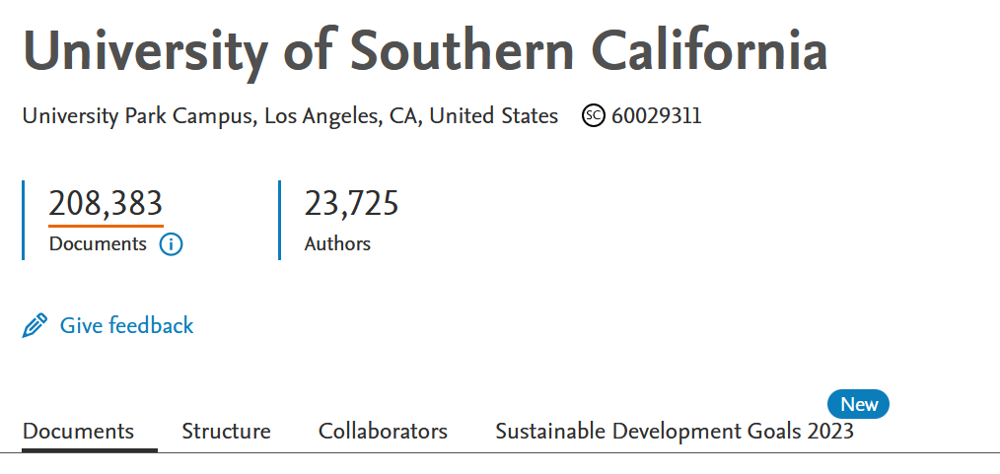

USC Sustainability Research Finder
================

- [Introduction](#introduction)
- [Requirements](#requirements)
- [Installation](#installation)
- [Usage](#usage)
  - [Folder Structure](#folder-structure)
- [Documentation](#documentation)
  - [Data](#data)
  - [Processing the Data](#processing-the-data)
  - [Mapping the Data](#mapping-the-data)
  - [Processed Data Schema](#processed-data-schema)
  - [Creating Elements for Shiny App](#creating-elements-for-shiny-app)
  - [Shiny App](#shiny-app)
- [Acknowledgements](#acknowledgements)
- [Questions?](#questions)

## Introduction

This
<a href="https://usc-sustainability.shinyapps.io/research-dashboard/"
target="_blank">Sustainability Resesarch Finder</a> is a R Shiny
dashboard that displays the results of mapping USC affiliated research
products to the United Nations 17 Sustainable Development Goals (SDGs).
Furthermore, each product is categorized as sustainability focused,
sustainability inclusive, SDG related, or not related. The results are
used for the <a
href="https://reports.aashe.org/institutions/university-of-southern-california-ca/report/2023-12-20/"
target="_blank">Sustainability Tracking, Assessment &amp; Rating System
(STARS)</a> and for metrics used in
<a href="https://sustainability.usc.edu/2028-framework/"
target="_blank">USC’s Assignment Earth Goals</a> 2.1 and Inclusion goal
3.3.

This project was initiated during the 2022 Fall
<a href="https://sites.usc.edu/ckids/about/" target="_blank">CKIDS
Datafest</a> at USC by Dr. Julie Hopper in the Office of Sustainability
and five USC students: Alison Chen, Aurora Massari, Bhavya Ramani, Ric
Xian and Xinyi Zhang. Feedback was provided by the USC PWG Research
Committee and incorporated by Dr. Julie Hopper and Alison Chen, with the
majority of the data processing pipelines and dashboard code implemented
by Alison Chen, a recent Masters student graduate from Viterbi School of
Engineering.

## Requirements

- <a href="https://www.r-project.org/" target="_blank">R</a>
- <a href="https://posit.co/download/rstudio-desktop/"
  target="_blank">RStudio</a>

## Installation

1.  <a
    href="https://docs.github.com/en/repositories/creating-and-managing-repositories/cloning-a-repository"
    target="_blank">Clone</a> this repository to open, view, and edit
    all the files in this repository on your computer (locally).
2.  Due to GitHub file size limitations, the complete USC research data
    could not be completely uploaded to the repository. As a result, the
    large data files are stored here <a
    href="https://drive.google.com/drive/folders/1FCNpPjeOBa0_kFAvGWjBKQ6TDEydviDi?usp=sharing"
    target="_blank">Complete Data Files on Google Drive</a>. Please
    download all three folders (“data_processed”, “data_raw”,
    “shiny_app”) and put them in the “Dashboard” folder of the cloned
    repository. You may be asked whether to replace those folder, and
    please click “replace”, as the folders on Google Drive contain the
    most complete data. The folder structure should look like this:

``` text
├── Dashboard
│   ├── Dashboard.Rproj
│   ├── STARS
│   ├── aux_funcs
│   ├── data_manual
│   ├── data_processed
│   ├── data_raw
│   ├── scripts_2020
│   ├── scripts_2023
│   └── shiny_app
├── LICENSE
├── README.Rmd
├── README.md
├── README_files
├── SustainabilityResearchFinder.Rproj
└── docs
```

3.  Open RStudio and click on  in the top right to open
    the <a
    href="https://support.posit.co/hc/en-us/articles/200526207-Using-RStudio-Projects#:~:text=Opening%20Projects,Rproj"
    target="_blank">project</a> file `Dashboard.Rproj`. This will
    automatically set the working directory as the project directory.

``` r
# check working directory
getwd()
```

In addition, many packages are used throughout this project which only
need to be installed once:

``` r
# install dplyr package
install.packages("dplyr")
```

Then load the package to access the functions:

``` r
# load dplyr package
library(dplyr)
```

<details>
<summary>
List of packages that need to be installed before running the shiny app
</summary>

``` r
install.packages("shiny")
install.packages("shinydashboard")
install.packages("tidyverse")
install.packages("plotly")
install.packages("wordcloud")
install.packages("DT")
install.packages("ggplot2")
install.packages("ggrepel")
install.packages("here")
install.packages("reshape2")
install.packages("scales")
install.packages("ggbreak")
install.packages("treemapify")
install.packages("stringr")
install.packages("shinyWidgets")
```

</details>

## Usage

To run the shiny app, open the app.R file in RStudio and click Run App.

To update keywords and/or context dependencies, add the new files to
data_raw/. In scripts_2023/08_run_text2sdg.R, updated the file names in
the two read.csv() functions. Then run 08_run_text2sdg.R and all the
following scripts (09, 10, etc.).

The current version uses the following keywords file and context
dependencies file:

- **Keywords file**:  
  [`USC_PWG-E_Keywords_11_5_24.csv`](https://github.com/USC-Office-of-Sustainability/SustainabilityResearchFinder/tree/master/Dashboard/data_raw/USC_PWG-E_Keywords_11_5_24.csv)

- **Context dependencies file**:  
  [`context_dependencies_01_21_25.csv`](https://github.com/USC-Office-of-Sustainability/SustainabilityResearchFinder/tree/master/Dashboard/data_raw/context_dependencies_01_21_25.csv)

To add new publications from Scopus, add the new file to data_raw/ and
then in scripts_2023/01_read_data.R, read the file and bind the new data
with all the other publications. Run all the files in scripts_2023/.

This README is a
<a href="https://rmarkdown.rstudio.com/github_document_format.html"
target="_blank">RMarkdown GitHub document</a>. To update the README,
open and edit the README.Rmd file in RStudio. Then click Knit to
generate the new README.md file. Upload/commit both files to GitHub.

### Folder Structure

- Dashboard/ contains all the code from processing the raw data to
  creating the Shiny dashboard
  - data_raw/ contains all the raw data (publications, keywords)
  - data_processed/ contains all the data generated by R scripts
  - data_manual/ contains all the data that was manually edited
  - scripts_2020/ contains all code for processing 2020-22 data
  - scripts_2023/ contains all code for processing 2023 data
  - shiny_app/ contains the code for the R Shiny dashboard
  - STARS/ contains the code used to generate summaries for STARS report
- docs/ is the code for the <a
  href="https://usc-office-of-sustainability.github.io/SustainabilityResearchFinder/"
  target="_blank">website</a> created for CKIDS Datafest 2022
- README_files/ contains all the images used in this README

## Documentation

### Data

- Publication data was downloaded from
  <a href="https://www.scopus.com/" target="_blank">Scopus</a> with the
  help of Xinyi Zhang.
  <details>
  <summary>
  How we downloaded the data from Scopus
  </summary>
  <ol>
  <li>
  Go to <a href="https://www.scopus.com/" target="_blank">scopus.com</a>
  and log in via institution by clicking the building icon in the top
  right.
  </li>
  <li>
  Search in Organization “University of Southern
  California”.
  </li>
  <li>
  Click the number of
  documents.
  </li>
  <li>
  Double check the search query by clicking
  edit.
  </li>
  <li>
  Select all documents and export (not download) as CSV. Include all
  Citation Information, Affiliations, Publisher, and all Abstract &
  Keywords. Tip: download year by year since there is a limit to the
  number of documents you can export at one
  time.
  </li>
  <li>
  To view the downloaded csv file in Excel, open Excel, go to the Data
  Tab \> Get Data \> From File \> From Text/CSV, select the csv and
  load. However, we recommend not editing the csv in excel since we ran
  into issues where the special characters in the data got messed up.
  </li>
  </ol>
  </details>
- Additional publications from the Gould School of Law were provided
  with the help of Amber Kennedy Madole.
  <details>
  <summary>
  How we added publications outside of Scopus
  </summary>
  <ul>
  <li>
  Create a Google Sheet with the following columns: Publication Type,
  Author Name (Last, First), Division, Department, authorID, Title,
  Abstract, Link, Year, Source Title, Volume, Issue, Article Number,
  Page start, Page end, Page count, DOI, Open Access.
  </li>
  <li>
  Each row is one author with one publication.
  </li>
  <li>
  Manually assign authorIDs by searching the author in the existing
  dataset and/or searching on Scopus. If the author does not exist,
  assign an arbitrary id such as Gould10.
  </li>
  </ul>
  </details>
- Keyword list, created in collaboration with the Presidential Working
  Group (PWG), is a list of words relevant to each of the 17 SDGs. The
  list is continuously being improved to improve accuracy.
- Context dependency list created by Julie Hopper is used to replace
  certain phrases to prevent them from being miscategorized by keyword
  mapping. For example, in “advertising ecosystem” the word ecosystem is
  replaced with the word domain since ecosystem in this context does not
  mean the same as ecosystem for SDG 15 Life on Land. Furthermore, some
  of the entries use <a
  href="https://cran.r-project.org/web/packages/stringr/vignettes/regular-expressions.html"
  target="_blank">regular expressions</a> such as “laws? of nature” and
  “international trade (\w\[ \w\]\*){1,3} environment”.
- USC department and division list is a list of departments, centers,
  and institutes and which divison (school) they belong to at USC.

### Processing the Data

scripts_2020/ contains to code for processing 2020-22 publications.
However, it is not feasible to rerun all the code every time there are
new publications. As a result, scripts_2023/ contains code for
processing new publications. Both sets of scripts have the same idea
overall.

#### 2020-22 data

1.  Read Data

First, in scripts_2020/01_read_data.R, we combine all the Scopus
publication data into one file. We also arbitrarily assign a pubID to
each publication. We only keep publications with specific year (2020-22)
and document type (article, conference paper, review, editorial, data
paper, book chapter, book, short survey). The combined data is the
publication file.

2.  Identify USC authors

Next, in scripts_2020/02_identify_usc_authors.R, we want to identify the
USC authors in the publication data by parsing the Authors with
affiliations column. However, when separating the Authors with
affiliations column using semicolons, sometimes it does not have the
same number of entries as the Authors ID column. Furthermore, sometimes
the affiliation for each author has multiple schools and is the same for
all the authors of the publication. As a result, for the publications
that are incorrectly formatted, we searched ten authorIDs (first nine
and last one) up on Scopus via Elsevier API.
<details>
<summary>
Using Elsevier API
</summary>
<strong>Prerequisites</strong>
<ol>
<li>
Create developer account at <https://dev.elsevier.com/>
</li>
<li>
Create an API key
</li>
<li>
Email support for an institution token
</li>
</ol>
<strong>Setting up the API key</strong>
<ol>
<li>
Create a .Renviron file with
</li>
</ol>

``` r
Elsevier_API=API_KEY
Institution_Token=INSTITUTION_KEY
```

\*Don’t add the .Renviron file to GitHub!

<strong>Using the API</strong>

``` r
elsevier_api_key <- Sys.getenv("Elsevier_API")
institution_token <- Sys.getenv("Institution_Token")
api_res = get_complete_author_info(au_id = 10042103300, count = 1, headers = c("X-ELS-Insttoken" = institution_token, "X-ELS-APIKey" = elsevier_api_key))
```

</details>

Using all the author data, we created two files: author and bridge. The
author file contains all the information about an author such as
authorID and name. The bridge file contains authorID and pubID pairs
where the pair exists if the person was an author of the publication.
The bridge file connects the author file to the publication file.

Next, we determined which division and department each author belongs
to. We created a spreadsheet with a list of all the departments and
divisions at USC based on the school’s website and the Author with
Affiliations column. The spreadsheet has three columns: Division,
Department, and Department Pattern. The Department Pattern column
contains regular expressions that are used to detect the respective
department. When using the pattern column, make all the text lowercase
or set ignore.case = TRUE in grep since there are typos that are not
always detected.

Some of authors have different authorIDs but are actually the same
person, so we automatically combined some USC authors. Ignoring the
authors with no department or division, we combined the authors that had
the same first name, last name, department and division. We also
combined authors that had the same first name, last name, and with one
or more department overlap. Then, we created a spreadsheet of authors
still with the same first and last name. Xinyi and Alison manually
checked the file to identify the authorIDs that were indeed the same
person. For every combination of authorID, there is an old authorID and
a new authorID. We used a named vector as a dictionary to map old
authorIDs to new authorIDs where the name of the vector is the old
authorID. The old authorID can be checked by `oldID %in% names(dict)`
and accessed by `dict[oldID]`. Finally, we made some manual fixes for
duplicate entries that we noticed.

3.  Get USC author info

Some authors do not have a department since their affiliation lacks
information. As a result, we searched up all the authors without a
department in the
<a href="https://uscdirectory.usc.edu/web/directory/faculty-staff/"
target="_blank">USC directory search</a> using
<a href="https://www.omegahat.net/RCurl/philosophy.html"
target="_blank">RCurl</a> and RJSONIO. We searched by first and last
name and looked through faculty and staff before students. However, if
the result is a person in a different division, we did not include the
information. Since the departments and divisions are written differently
than my list of departments and divisions, we had to fix a lot of
division names and rematch the departments to the department patterns.

To run the code in scripts_2020/03_get_usc_author_info.R, create a
“uscdirectory.cookie” file.
<details>
<summary>
Where to Find the Cookie
</summary>
<ol>
<li>
Using Chrome, go to
<a href="https://uscdirectory.usc.edu/web/directory/faculty-staff/"
target="_blank">USC directory search</a>.
</li>
<li>
Right click on the page and select Inspect.
</li>
<li>
In the panel, select Network.
</li>
<li>
Search Julie Hopper in the USC Directory Search bar.
</li>
<li>
Find the entry in the network where the Request URL looks like
<code>https://uscdirectory.usc.edu/web/directory/faculty-staff/proxy.php?basic=julie%20hopper</code>
</li>
<li>
Scroll down to the Request Headers section and copy the cookie to your
uscdirectory.cookie file.
</li>
</ol>
</details>

4.  Create departments and divisions table

The department and division columns each hold multiple entries. The goal
of scripts_2020/04_create_dept_div.R is to match each department with
the correct division and have one department and division in each row.
The directory search created a lot of new departments which needed to be
renamed.

5.  Add law publications

For the Gould School of Law, we had an additional list of publications
since not every publication is on Scopus. However, some publications are
on Scopus so we excluded those that were duplicates based on the title
and year. In the law publication spreadsheet, we manually assigned the
authors an authorID by searching for their name in the existing data. If
they were not found, we assigned them an ID in the format Gould#. In
scripts_2020/05_add_law_pubs.R, we used the law publication spreadsheet
to create columns needed to create three files: author, bridge, and
publication.

6.  Fix authors manually when we notice errors

Over time, we noticed duplicate authors that were not combined, so we
tracked all the changes in scripts_2020/07_fix_authors.R. For each
combination, we would remove the entry from the author file and replace
the old authorID with the new authorID in the bridge file as shown
below.

``` r
# Gould1 -> 57657883900 for Jody Armour
usc_authors <- usc_authors[-which(usc_authors$authorID == "Gould1"),]
usc_bridge$authorID[which(usc_bridge$authorID == "Gould1")] <- 57657883900
```

7.  Fix authors based on spreadsheet

There were some authors with the same first and last name but different
departments and divisions, so Julie Hopper helped check them. Then in
scripts_2020/08_fix_authors.R the authorIDs were combined using the same
method as step 2 (scripts_2020/02_identify_usc_authors.R) using a
dictionary to map old authorIDs to new authorIDs and updating the author
and bridge file.

8.  Fix departments

There were still too many departments with mistakes so Julie Hopper
manually fixed them. In addition, we incorporated more METRANS
affiliated researchers in scripts_2020/09_fix_dept.R.

9.  Past authorIDs

Throughout this process, multiple authorIDs were combined together, but
old authorIDs were simply replaced with new authorIDs and the history
was not saved. There should have been a column filled with previous
authorIDs. As a result, we went through all the scripts to save all the
dictionaries used to map old authorIDs to new authorIDs and combined
them into one file in scripts_2020/14_past_authorIDs.R. This information
will be useful when new publications are added and old authorIDs show
up.

#### 2023 data

1.  Read data

Similar to reading 2020-22 data, we combined all publication data: old
2020-22 data, missing publications from 2020-22, and new 2023 data. Some
publications got updated information, so we only kept the most recent
one. We also removed all documents of type retracted, letter, note and
erratum and only kept publications with years 2020-23. We continued to
arbitrarily assign pubIDs to the new publications. The combined data is
the publication data.

2.  Identify USC authors

Next, we want to identify USC authors in the new data. Most of the code
in scripts_2023/02_identify_usc_authors.R was based on
scripts_2020/02_identify_usc_authors.R with some improvements. When the
authors with affiliation column does not match up with the author name
column, we used the last name to find the affiliation that starts with
the same lastname. The bridge table is generated using the pubID and
authorID columns.

3.  Identify USC departments and divisions

Next, we want to identify the departments and divisions each author
belongs to. The code for this in scripts_2023/03_identify_usc_dept_div.R
is a combination of scripts_2020/03_get_usc_author_info.R,
scripts_2020/04_create_dept_div.R, and scripts_2020/09_fix_dept.R.
First, we used regular expressions to match each author’s affiliations
with the list of USC departments and list of USC divisions to create a
column of departments and divisions for each author. Then, we separated
the departments and divisions such that for each row, there is only one
department with its corresponding division for one author. Finally, we
did the same department fixes and METRANS additions as for the 2020
data.

In addition, for authors that already exist, we combined the author IDs
that were previously combined based on the past authorID file generated
by scripts_2020/14_past_authorIDs.R.

The result is an author file and an updated bridge file.

4.  Combine with 2020 data

Next, we want to combine the 2023 author and bridge files with the old
author and bridge files. When combining the author data, we want to keep
the first entry but still have the affiliation information. Also, we
removed duplicates in the bridge file.

5.  Add law publications

scripts_2023/05_add_law_pubs.R is almost exactly the same as
scripts_2020/05_add_law_pubs.R for adding new law publications. We have
a new spreadsheet of law publications to add. We removed law
publications that already exist in our dataset, manually assigned
authorIDs in the spreadsheet, assigned pubIDs to the new law
publications, and created columns to match the existing author, bridge,
and publication files. In addition, all law departments are labeled as
Law.

6.  Combine authors

Next we need to combine authors that have multiple ids. The code for
this in scripts_2023/06_combine_authors.R is based on
scripts_2020/02_identify_usc_authors.R. We combined authors with the
same First Last name, department, and division. We kept the authorID
that had more publications. We continued to make dictionaries with named
vectors to map old authorIDs to new authorIDs. We also combined authors
with the same first name, last name, department, and division, but
excluded the middle name/initial. Finally, for authors with only one
letter as first name, we combined the authors with the same first
letter, last name, department, and division. This was manually double
checked by Xinyi Zhang since sometimes the first letter is a little too
general. All of the combining was done using lowercase names since there
were some entries that were all in uppercase and some names were
capitalized differently.

7.  Manually edit authors

There are still authors that are missed, so in
scripts_2023/07_manual_edit_authors.R, we combined authorIDs manually
whenever we notice them.

### Mapping the Data

In scripts_2023/08_run_text2sdg.R, we mapped the data to the United
Nations 17 Sustainable Development Goals (SDGs) using
<a href="https://www.text2sdg.io/" target="_blank">text2sdg</a>’s
`detect_any()` function, which requires text and a system. The text is
the title, abstract, author keywords, and indexed keywords, while the
system is the keyword list created with the help of the Presidential
Working Group converted to a three column format: system name, SDG, and
query. All of the text and keywords are converted to lowercase and do
not have punctuation to make mapping better. Additional symbols in the
keyword list are removed to prevent errors. Furthermore, some phrases in
the text are substituted based on the context dependencies list.

Next we run detect_any() using our keyword system. detect_any() will
only count a keyword once. The output from detect_any() is a dataframe
with columns: document, sdg, system, query_id, features, hit. The
important columns are document, sdg, and features. The document number
corresponds to the row number of the input dataframe. SDG got changed
into ‘SDG-01’ not 1. Features that are made up of multiple words get
split by commas in this column, so they are glued back together. If a
publications gets mapped to multiple SDGs it will show up multiple rows
in the dataframe. For a document to count as an SDG, we require the
document to have at least two or more keywords related to that SDG.
Furthermore, we use <a href="https://github.com/hrbrmstr/pluralize"
target="_blank">pluralize</a>’s singluarize() function to count school
and schools as one keyword. (The singularize() function is not 100%
accurate.)

Using the mapped results, we then label each publication as
Sustainability-Focused, Sustainability-Inclusive, SDG-Related, and Not
Related.

- If a publication maps to one or more environmental SDG (6, 7, 12, 13,
  14, 15) AND one or more social/economic SDG (1, 2, 3, 4, 5, 8, 9, 10,
  11, 16, 17), then it is Sustainability-Focused.
- If a publication maps to more than 2 SDGs, then it is
  Sustainability-Inclusive.
- If a publication maps to exactly 1 SDG, then it is SDG-Related.
- If a publication does not map to any SDG, then it is Not Related.

In addition, we did a manual review of the results and corrected some of
the sustainability categories in scripts_2023/09_manual_category_fix.R.

### Processed Data Schema

With all the data processed, below is a visual representation of the
relationships between the input files for the shiny app. The files are
separate since joining them all together creates a huge file. It is
possible to put the data in a SQLite database using the
<a href="https://rsqlite.r-dbi.org/" target="_blank">DBI and RSQLite
packages</a>. However, the resulting .db file still takes up the same
amount of space as three separate csv files.

<figure>

<figcaption aria-hidden="true">ER Diagram</figcaption>
</figure>

### Creating Elements for Shiny App

To make the shiny app run a little faster, we generated some data
outside the shiny app script.

#### Sustainability Research in Los Angeles

This data processing component relates to obtaining metrics for the
second part of USC’s Assignment Earth Goal 3.3: “By June 2023, develop a
comprehensive catalog of the sustainability research and programs at USC
that work with local communities disproportionately impacted by
environmental disruptions and risk exposures, measured by document
review and other measures.”

To obtain these metrics, we used the map research data to look at
sustainability focused and inclusive publications and used a <a
href="https://github.com/USC-Office-of-Sustainability/SustainabilityResearchFinder/tree/master/Dashboard/data_raw/AsgmtEarth_DEI_3.3_Catalog_Keywords.csv"
target="_blank">list of keywords</a> to identify publications that are
related to local Los Angeles communities that are disproportionately
impacted by environmental disruptions and risk exposures. In addition,
we ordered the publications such that publications with specific
keywords show up at the top, then sustainability focused, then inclusive
publications. The code can be found in scripts_2023/10_dei.R.

#### Wordcloud

In scripts_2023/11_wordcloud.R, we generated one wordcloud for each SDG
based on the keywords (features from text2sdg’s detect_any() output)
that were found in the data. Generated images are saved in
shiny_app/www/.

#### Stacked Bar Chart Data

scripts_2023/12_stacked_bar_chart_data.R is an example of doing
calculations outside of the shiny app so that loading the graphs is
faster in the shiny app. We read in all the data, summarize to get the
data we want displayed in the bar charts, and save the csv files in
shiny_app/.

### Shiny App

The main file for the
<a href="https://rstudio.github.io/shinydashboard/"
target="_blank">shiny app</a> is shiny_app/app.R. The www/ folder is
expected by a Shiny application to contain images and stylesheets. The
data needed to run the shiny app is located on <a
href="https://drive.google.com/drive/folders/1TfTNNMqb9SnHM0J_f8IxTGSnKx80idpg?usp=drive_link"
target="_blank">Google Drive</a> since the files are too big to store on
GitHub.

Our dashboard is hosted on the web with
<a href="https://shiny.posit.co/r/articles/share/shinyapps/"
target="_blank">Shinyapps.io</a>. Also, we did some load testing using
Python <a href="https://locust.io/" target="_blank">Locust</a>.

## Acknowledgements

This project was initially inspired by Carnegie Mellon’s work on mapping
its courses to the 17 UN SDGs. For more information, please read about
our initial collaboration with Alex Hinicker and Peter Wu in our <a
href="https://github.com/USC-Office-of-Sustainability/SustainabilityCourseFinder"
target="_blank">Sustainability Course Finder Github Repository</a>. This
project has been improved by feedback from many students, staff and
faculty in
<a href="https://sustainability.usc.edu/" target="_blank">USC’s Office
of Sustainability</a> and in
<a href="https://www.president.usc.edu/sustainability-pwg/"
target="_blank">USC’s Presidential Working Group on Sustainability in
Research</a>. In particular, we would like to recognize the following
people for their contributions to the development of this project, and
the data and code: Alison Chen, Amber Madole, Aurora Massari, Bhavya
Ramani, Brian Tinsley, Julie Hopper, Ric Xian, and Xinyi Zhang.

## Questions?

If you have any questions, comments, or concerns, please reach out to
Alison Chen <achen807@usc.edu> or Julie Hopper <juliehop@usc.edu>
