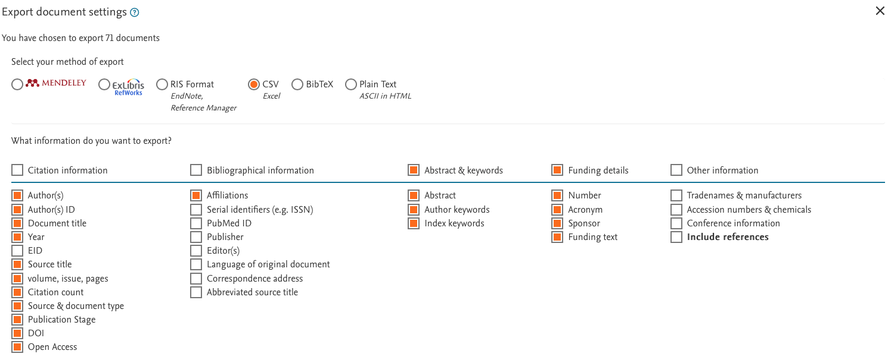
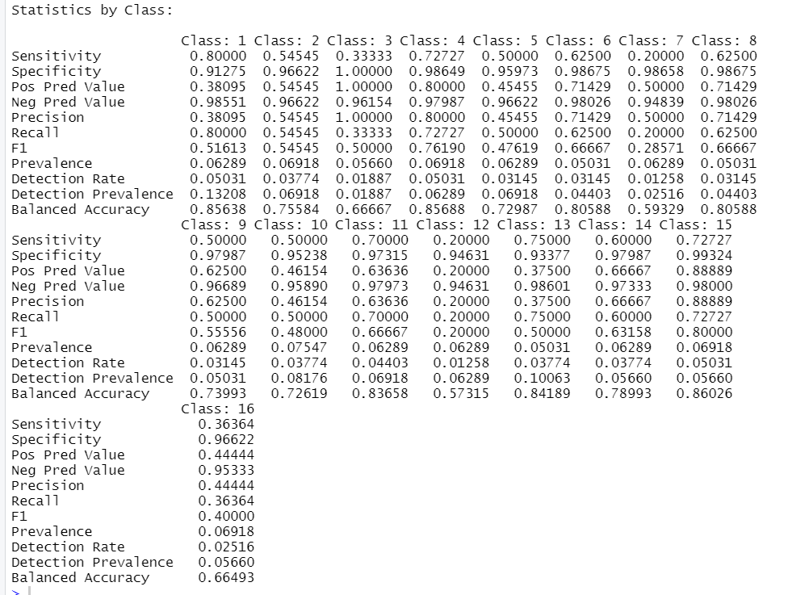

---
# Feel free to add content and custom Front Matter to this file.
# To modify the layout, see https://jekyllrb.com/docs/themes/#overriding-theme-defaults

layout: default
showtoc: true
showcarousels: true
carousels:
    - images: 
        - image: assets/images/HomePage.png
        - image: assets/images/SDG2.PNG
        - image: assets/images/SDGByYear2020.png
        - image: assets/images/SDGOrNotPie.png
        - image: assets/images/TopAuthorsSDG14.png
        - image: assets/images/TopDeptSDG7.png
        - image: assets/images/ByDept.png
        - image: assets/images/AuthorSDGs.png

         
---
# Motivation

**Our goal of this project was to classify USC-affiliated research to the UN Sustainable Development Goals (SDGs) in order to:**
1. Create a central research directory (via an interactive dashboard) where USC students, postdocs and faculty can connect with USC scholars based on shared interests.
2. Track USC’s progress on its goal to increase its interdisciplinary research and training for sustainability and climate change solutions (see [USC’s Asgmt: Earth Research Goals](https://sustainability.usc.edu/assignment-earth/2028-framework/goals/)).
3. Improve USC’s STARS (Sustainability Tracking, Assessment & Rating System) Rating from Silver to Gold in our next submission in 2024.
    a. One of USC’s low-scoring areas in 2021 was related to data gaps in sustainability research metrics ([USC's 2021 score for the AC-9 credit](https://reports.aashe.org/institutions/university-of-southern-california-ca/report/2021-07-29/AC/research/AC-9/))
4. Create a framework for other institutions to use to conduct similar SDG mapping projects and to accelerate their STARS reporting process for the AC-9 credit.

{: height="250"} {: height="250"}

# Problem
**What method should we use to classify USC publications by the UN SDGs?**

We used and compared two methods:  
1. Use an mBert Machine Learning Model (Aurora University)
2. Use Scopus Query results (Elsevier)

**How should we display the results for an optimized user experience?**

Created a dashboard using Rshiny based on the Scopus query results

# Data Collection
**Data for Testing Aurora’s Machine Learning Program**

Created a curated list of publications with assigned primary and secondary SDG  
- 10 publications per SDG, including ‘0’ (for research not related to the SDGs)

**Data for Creating an Interactive Research Dashboard**

Downloaded 2020-2022 USC affiliated publications from [Scopus](https://www.scopus.com/search/form.uri?display=advanced) (Sign in with USC's VPN to access)
- Selected USC affiliated publications: University of Southern California, Keck School of Medicine of USC, USC Norris Comprehensive Cancer Center, Los Angeles County USC Medical Center, Information Sciences Institute, USC School of Pharmacy, USC Marshall School of Business, Herman Ostrow School of Dentistry of USC, USC Ethel Percy Andrus Gerontology Center, “Women's Hospital, Los Angeles”, USC Gould School of Law, Keck Hospital of USC, Keck Medicine of USC
- Used Elsevier's 2022 search queries for SDG 1 to 16
- Downloaded selected columns

- Designated SDG 0 to all the USC publications that didn’t match to the SDGs

# Methods
## Machine Learning

We tested Aurora’s Machine Learning mBert Model on:
1. Our manually curated dataset (10 pubs/SDG)
2. The output of the scopus query results

## RShiny Dashboard

We created an interactive dashboard using RShiny:
- Found USC authors in each publication by parsing the data, using Scopus API and web scraping the USC faculty directory
- Adapted from R code used for the [USC Curriculum Mapping Dashboard](https://github.com/USC-Office-of-Sustainability/USC-SDG-Curriculum), authored by Brian Tinsley and Dr. Julie Hopper

# Results
## Machine Learning
1. Output from Aurora's mBert model on our manually curated dataset:
- In our manually curated data set we assigned primary and secondary SDGs for each publication since publications can be mapped to multiple SDGs.
- Let the predicted SDG with the highest probability be the predicted primary SDG.
- 54% accuracy when comparing the predicted primary SDG with the primary SDG that we manually assessed for the publication
- 77% accuracy when comparing the predicted primary SDG with any of the secondary SDGs that we manually assessed for the publication
- 92% accuracy when comparing any of the predicted SDGs from the model with any of our manually assessed SDGs for a given publication. 
- See output below for detailed ML results for each separate SDG class. Note- balanced accuracy is different than the actual accuracy of the model output compared to the actual SDGs (as noted above). 

2. Output from Aurora’s mBert model on the Scopus Query Results
- In progress (currently crashing our laptops, data = 26,335 rows).

## RShiny Dashboard
<!--  -->
<iframe height="700" width="100%" frameborder="no" src="https://usc-sustainability.shinyapps.io/research_dashboard/"> </iframe>

# Discussion

**What we did**

- Run Aurora’s ML model to categorize publications
- Create RShiny Dashboard

**What the Results Imply**

- Using Elsevier search queries  
    - there are alot of SDG 3 USC publications
    - Half the USC publications are not related to any SDG

**Improvements that can be made**

- Correction of false negatives (cases when USC scholars are not mapping to SDGs when in fact they conduct research related to specific SDGs)
- Investigation of false positives and other SDG mapping errors. Followed by corrections to improve dashboard output accuracy.
- We could investigate the accuracy between Aurora mBert ML output versus the Scopus Query results in RShiny Dashboard. Then for each publication we display a graph displaying probabilities.
- Improve performance of RShiny Dashboard 
    - Large number of dropdown options
    - Improve graphics

# What we learned

Learned to use data tools! 
- R, RShiny, git
- Deep learning models (Aurora's mBert program)